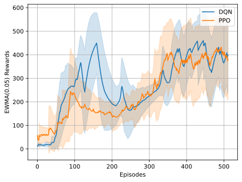

# Experimenting Reinforcement Learning with Rust [Burn](https://github.com/Tracel-AI/burn)

## CartPole with DQN

**Remark.** This project uses [gym-rs](https://github.com/MathisWellmann/gym-rs) for simulating environments.
Note that the CartPole implementation in gym-rs may lead to slow convergence due to its extended initial state space.
To address this, apply the modification
from [this branch](https://github.com/yunjhongwu/gym-rs/tree/fix-cartpole-starting-state)
and replace `gym-rs = "0.3.0"` with `gym-rs = { path = "../../gym-rs" }` in [Cargo.toml](./burn-rl/Cargo.toml) to align the
initialization with the standard behavior of OpenAI Gym CartPole.

## References

- [PyTorch RL tutorial](https://pytorch.org/tutorials/intermediate/reinforcement_q_learning.html)

