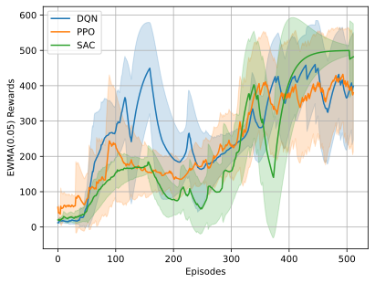

# Experimenting Reinforcement Learning with Rust [Burn](https://github.com/Tracel-AI/burn)

## Training on CartPole

### Agents
The project implements the following algorithms:
 - Deep Q-Network (DQN)
 - Proximal Policy Optimization (PPO)
 - Soft Actor-Critic for Discrete Action (SAC-Discrete)

### Environment
This project uses [gym-rs](https://github.com/MathisWellmann/gym-rs) for simulating environments. Users can create their own environment by implementing the `Environment` trait.

## References

- [PyTorch RL tutorial](https://pytorch.org/tutorials/intermediate/reinforcement_q_learning.html)
- [PPO with TorchRL tutorial](https://pytorch.org/rl/tutorials/coding_ppo.html)
- Christodoulou, P. (2019). Soft actor-critic for discrete action settings. *arXiv preprint arXiv:1910.07207*.